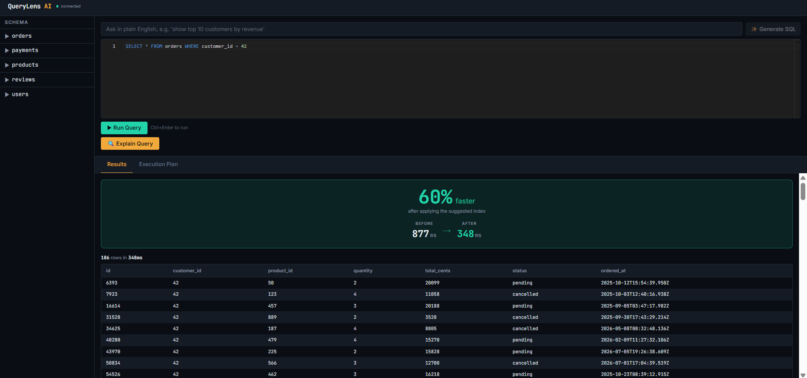
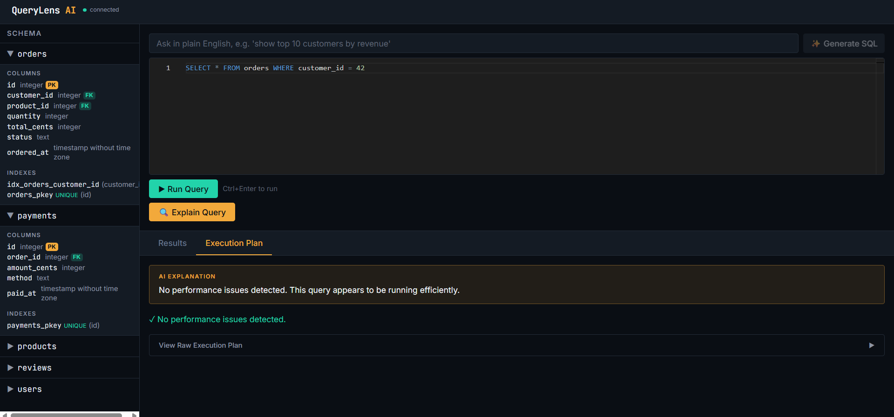
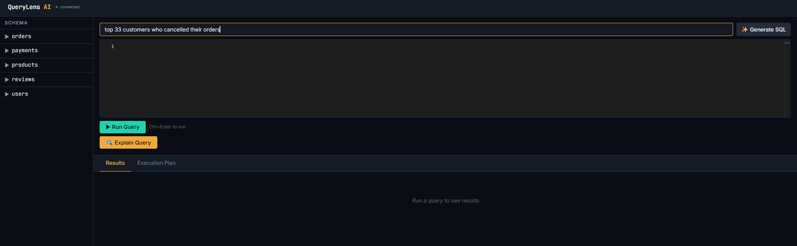
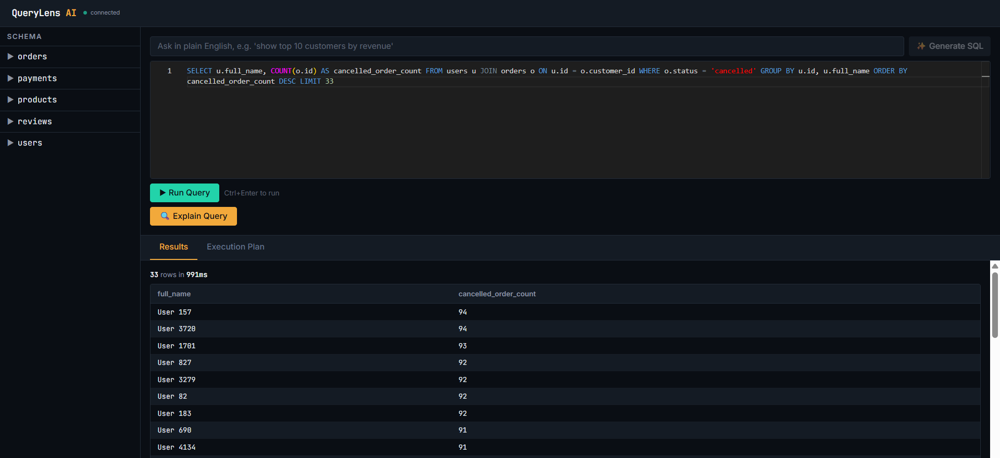
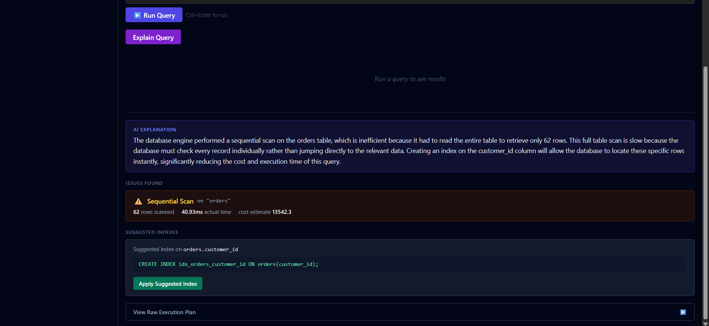
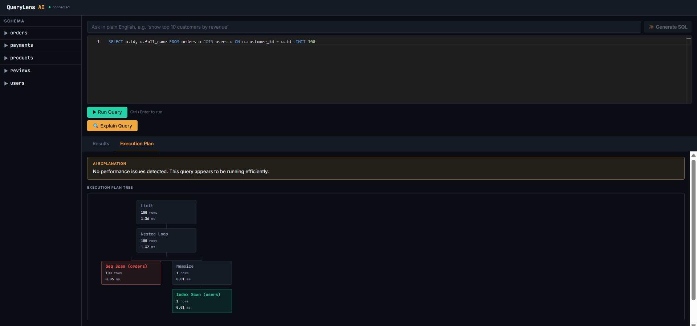
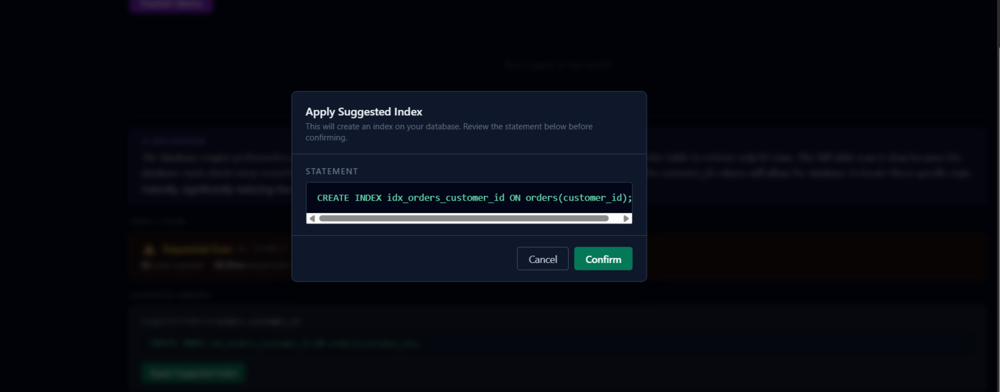

# QueryLens AI

**An AI-powered database performance and optimization assistant that helps developers understand, analyze, and optimize PostgreSQL queries using execution plans, intelligent recommendations, and natural language interaction.**

Not a "chat with your database" app. Not another SQL generator. A developer tool that finds real performance problems, explains them in plain English, and proves the fix works — live, in front of you.

🔗 **Live app:** https://querylens-nu.vercel.app
🔗 **API:** https://querylens-production-515e.up.railway.app

---

## The moment that matters



Run a slow query. QueryLens finds the missing index, explains why it's slow, and lets you apply the fix with one click — then proves it worked with a real before/after number, not a promise: **877ms → 348ms, 60% faster**, measured live against a 1-million-row PostgreSQL table.

---

## Walkthrough

**1. Browse the schema** — tables, columns, types, primary/foreign keys, and existing indexes for any connected database, introspected live via `information_schema`/`pg_catalog`.



**2. Describe what you want in plain English** — natural language is converted to SQL by Gemini, using the *live* schema of whichever database is connected (not a hardcoded assumption).



**3. Review the generated SQL before running it** — AI never executes anything automatically. The query lands in the editor for review first, exactly like a query a human wrote.



**4. Find out *why* a query is slow** — a deterministic rule engine parses the real PostgreSQL execution plan (not a guess) and detects sequential scans, inefficient joins, and disk sorts. AI only explains the finding in plain English; it never decides what's wrong.



**5. See the actual execution plan, visually** — the real recursive plan tree returned by Postgres, rendered as a connected node graph and color-coded by performance characteristics (coral for sequential scans, teal for index scans).



**6. Apply the fix with confidence** — the suggested index statement is shown in full before anything runs. Only statements the app itself generated are ever accepted; no arbitrary DDL, however well-formed, is ever executed.



**7. Prove it worked** — back to the top: a measured before/after comparison, not an estimate.

---

## What it does

1. **Write or generate SQL** — a Monaco-powered editor (the same engine behind VS Code), or describe what you want in plain English and let AI generate the query for you
2. **Run it safely** — sandboxed execution, read-only by design, with row limits and timeouts
3. **Explore your schema** — browse tables, columns, types, primary/foreign keys, and existing indexes for any connected database
4. **Understand *why* a query is slow** — a deterministic rule engine parses the real PostgreSQL execution plan and detects sequential scans, inefficient joins, and disk sorts. AI only explains the findings in plain English — it never decides what's wrong
5. **See it visually** — an interactive execution plan tree renders the actual query plan as a connected node graph, color-coded by performance characteristics
6. **Fix it with confidence** — apply the suggested index through a restricted, validated endpoint that only ever executes statements the app itself generated, never arbitrary SQL
7. **Prove it worked** — a live before/after comparison shows the real performance improvement, measured, not estimated

## Why this exists

Most portfolio projects in this space are either a CRUD clone or a generic "chat with your PDF/database" wrapper around an LLM. Neither demonstrates much beyond API integration.

QueryLens is built around a different idea: **the AI's job is explanation, not decision-making.** Every performance finding comes from a deterministic rule engine reading real PostgreSQL execution plan data — the AI only translates those findings into plain English. This keeps the core logic auditable, testable, and free of hallucination risk, while still using AI where it genuinely adds value (natural language understanding, explanation quality).

## Tech Stack

**Frontend:** React, TypeScript, Tailwind CSS, Monaco Editor, Axios, Vite
**Backend:** Node.js, Express, TypeScript
**Database:** PostgreSQL (local for development, [Neon](https://neon.tech) serverless Postgres for production)
**AI:** Google Gemini API (2.5-flash generation for NL→SQL and explanations)
**Deployment:** [Vercel](https://vercel.com) (frontend) · [Railway](https://railway.app) (backend) · [Neon](https://neon.tech) (database)

## Architecture

```
React (SQL Editor / Schema Explorer / Plan Tree / Comparison Card)
        │
        ▼
Node.js + Express API
   ├─ Validates & safely executes SQL (allowlist: SELECT / WITH / EXPLAIN only)
   ├─ Runs EXPLAIN (ANALYZE, FORMAT JSON) and parses the real plan tree
   ├─ Deterministic rule engine detects performance issues (no AI involved)
   ├─ Gemini API explains findings in plain English (never decides what's wrong)
   └─ Restricted apply-index endpoint (exact-match validation against
      server-generated statements only — no client-supplied DDL ever executes)
        │
        ▼
PostgreSQL — local (dev) / Neon (production)
```

Full technical documentation — including the request/response contracts, database schema, and every design decision made during the build — lives in [`docs/`](./docs):
- [`requirements.md`](./docs/requirements.md) — scope and success criteria
- [`architecture.md`](./docs/architecture.md) — system design, including two real design corrections made mid-build (see below)
- [`database.md`](./docs/database.md) — schema, seed strategy, role permissions
- [`api.md`](./docs/api.md) — full API contract
- [`ui.md`](./docs/ui.md) — component and layout specification
- [`roadmap.md`](./docs/roadmap.md) — deliberately deferred features

## Security design

Security wasn't an afterthought — it's the backbone of how AI is allowed to interact with the database at all:

- **Query execution is allowlisted**, not blocklisted — only `SELECT`, `WITH`, and `EXPLAIN` statements are ever accepted, with stacked-statement injection explicitly blocked (`SELECT 1; DROP TABLE users;` is rejected even though it starts with `SELECT`)
- **Memory-safe row capping** — large queries are capped at the database level via a wrapped subquery, never by fetching an entire result set into application memory first
- **AI-generated SQL is never trusted blindly** — output from the natural-language-to-SQL feature is validated through the exact same allowlist as direct user input before it's ever shown to the user
- **Index application uses exact-match validation** — the `/apply-index` endpoint only ever executes `CREATE INDEX` statements that the server's own rule engine generated and recorded in-session. No client-supplied DDL, however well-formed, is ever accepted
- **Least-privilege database roles** — a dedicated read-only Postgres role executes all query/explain operations. During development, I discovered PostgreSQL requires table *ownership* (not just schema-level `CREATE` privilege) to run `CREATE INDEX` on an existing table — a real constraint with no finer-grained workaround. Rather than grant broader ownership privileges to fix this, I kept the exact-match validation as the true security boundary and used the admin connection only for that one, fully-gated operation. This tradeoff is documented in detail in [`architecture.md`](./docs/architecture.md)

## Notable engineering decisions

A few things worth highlighting if you're evaluating this project technically:

- **The rule engine is deterministic, not AI-driven.** It parses real `EXPLAIN (ANALYZE, FORMAT JSON)` output and detects issues via plain conditional logic — sequential/parallel scans, inefficient joins, disk sorts. AI is used exclusively to translate structured findings into readable English, never to decide what's wrong. This was tested against real execution plans, including catching a bug where PostgreSQL's automatic query parallelization (`Parallel Seq Scan`) wasn't initially recognized by a rule engine written against the non-parallel `Seq Scan` node type alone
- **The natural-language-to-SQL feature introspects the live database schema at request time** (with a short-lived cache), rather than using a hardcoded schema description — meaning the tool works against any connected PostgreSQL database, not just this project's demo data
- **The visual execution plan tree** renders the real recursive plan structure returned by Postgres, with pure CSS connector lines (no charting library, no SVG) that correctly join parent and child nodes regardless of how many children a node has or how wide their subtrees are

## Roadmap (deliberately out of scope for v1)

To keep this project honest and finishable, several features were scoped out and documented rather than half-built. See [`roadmap.md`](./docs/roadmap.md) for the full list, including: authentication, query rewrite suggestions, ER diagram generation, database health scoring, and multi-database (non-Postgres) support.

## Running it locally

```bash
git clone https://github.com/devaswani18/Querylens.git
cd Querylens

# Backend
cd server
npm install
cp .env.example .env   # fill in your own DATABASE_URL, GEMINI_API_KEY, etc.
psql $DATABASE_URL -f db/schema.sql
psql $DATABASE_URL -f db/seed.sql
npm run dev

# Frontend (separate terminal)
cd ../client
npm install
cp .env.example .env   # set VITE_API_BASE_URL to your backend URL
npm run dev
```

Full setup details, including the database role setup, are in [`docs/database.md`](./docs/database.md).

## License

MIT
