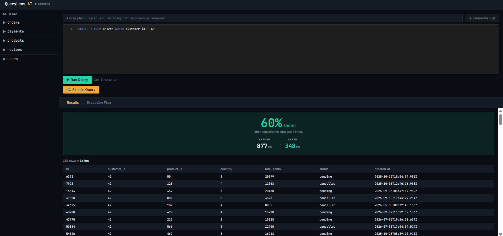
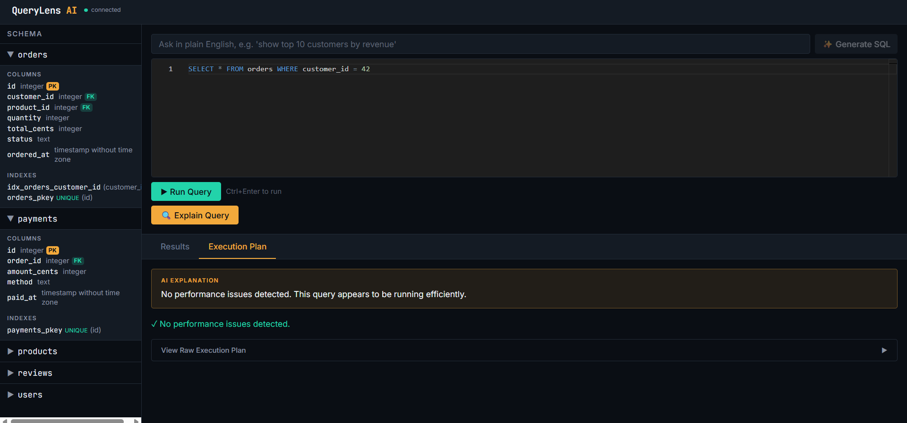
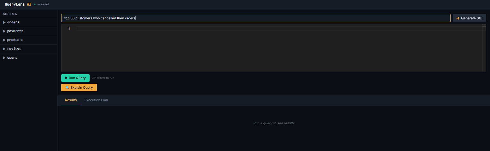
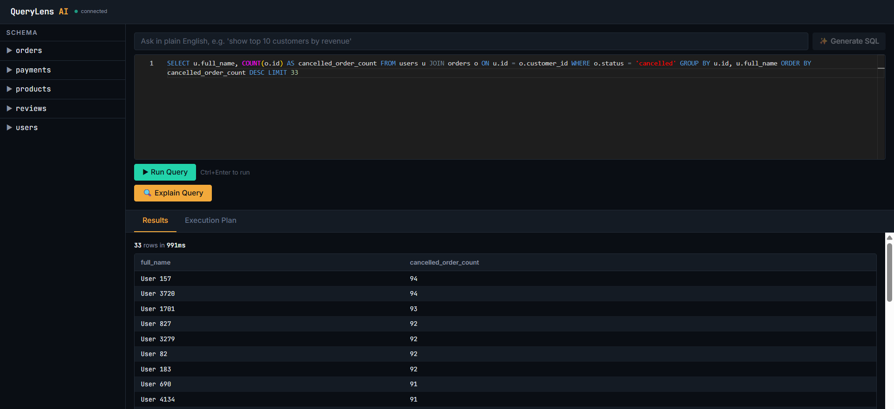
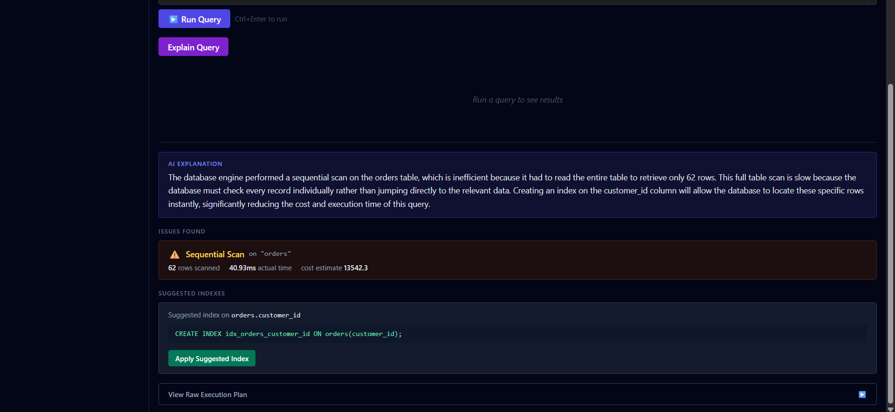
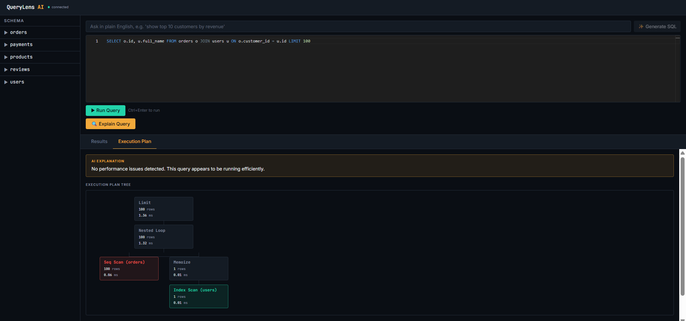
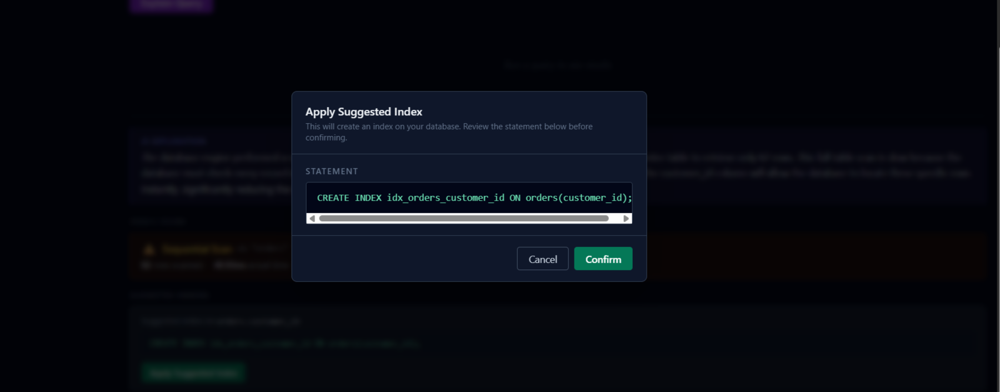

# QueryLens

QueryLens is a tool that helps developers find and fix slow PostgreSQL database queries. You run a query, and it tells you exactly why it's slow, suggests a fix, and lets you prove the fix actually worked with a real before-and-after speed comparison.

**Live app:** https://querylens-nu.vercel.app
**API:** https://querylens-production-515e.up.railway.app

---

## The main thing it does

Run a slow query. QueryLens finds the reason it's slow (like a missing index), explains it in plain English, and lets you apply the fix with one click. Then it re-runs the query and shows you the real speed improvement — for example, **877ms → 348ms, 60% faster** — measured live, not estimated.



---

## How it works, step by step

**1. Browse your database structure** — see all your tables, columns, and existing indexes.



**2. Ask for what you want in plain English** — type what you want in normal language, and it gets turned into a real SQL query based on your actual database's structure.



**3. Review the SQL before it runs** — nothing runs automatically. You see the exact query first, just like if you'd written it yourself.



**4. Find out why a query is slow** — the app reads PostgreSQL's own internal report on how it ran your query, and checks it against a set of known slow patterns (like scanning an entire table instead of using an index). The AI only explains what was found in plain English — it doesn't decide what's wrong, the rule checking does.



**5. See it as a diagram** — the same internal report, shown as a visual flowchart, color-coded so you can spot the slow parts at a glance.



**6. Apply the fix** — the suggested fix is shown in full before you approve it. The app only ever runs a fix it generated itself, never anything typed in directly.



**7. See proof it worked** — the same query runs again, and you get a real, measured speed comparison.

---

## Why I built it this way

A lot of "AI + database" projects just let an AI write and run SQL directly, which is risky — the AI could make a mistake or get tricked into doing something harmful. I built this the opposite way: **a normal, predictable set of rules decides what's actually wrong with a query, and the AI's only job is explaining that finding in plain English.** The AI never decides what's wrong and never runs anything on its own. This makes the app more trustworthy, since the important logic isn't just "whatever the AI feels like doing."

---

## Safety features

- Only safe, read-only queries (`SELECT`) are ever allowed to run — nothing that could change or delete data
- It checks for and blocks attempts to sneak in a second, harmful command hidden inside a query
- Large results are automatically limited so one query can't overload the app
- The AI-generated SQL goes through the exact same safety checks as anything a person types in — it's never trusted blindly
- When applying a suggested fix (like adding an index), the app only ever runs the exact fix it generated itself in that session — never anything else, even if it looks similar

---

## Tech Stack

- **Frontend:** React, TypeScript, Tailwind CSS, Monaco Editor (the code editor VS Code uses)
- **Backend:** Node.js, Express, TypeScript
- **Database:** PostgreSQL (Neon for the live version)
- **AI:** Google Gemini API
- **Deployment:** Vercel (frontend), Railway (backend), Neon (database)

---

## Running it locally

```bash
git clone https://github.com/devaswani18/Querylens.git
cd Querylens

# Backend
cd server
npm install
cp .env.example .env   # add your own database URL and Gemini API key
psql $DATABASE_URL -f db/schema.sql
psql $DATABASE_URL -f db/seed.sql
npm run dev

# Frontend (in a separate terminal)
cd ../client
npm install
cp .env.example .env   # point this at your backend's URL
npm run dev
```

---

## Things I intentionally left out for now

To keep the project realistic to finish, a few features were left out on purpose rather than half-built: user login/accounts, support for databases other than PostgreSQL, and a few other extras. These are documented in [`docs/roadmap.md`](./docs/roadmap.md) if you want the full list.

---

## License

MIT
